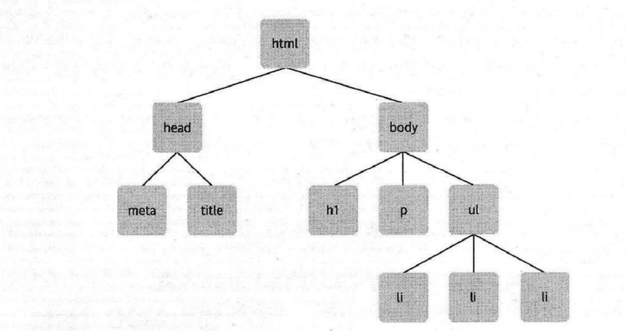

- [1. 节点](#1-节点)
- [2. 元素节点](#2-元素节点)
- [3. 文本节点](#3-文本节点)
- [4. 属性节点](#4-属性节点)
- [5. 获取元素](#5-获取元素)
  - [5.1. getEmelentById](#51-getemelentbyid)
  - [5.2. getElementsByTagName](#52-getelementsbytagname)

# 1. 节点
```html
<!DOCTYPE html>
<html lang="en">
<head>
    <meta charset="UTF-8">
    <meta http-equiv="X-UA-Compatible" content="IE=edge">
    <meta name="viewport" content="width=device-width, initial-scale=1.0">
    <title>Document</title>
</head>
<body>
    <h1>购物清单</h1>
    <p>别忘了买这些东西</p>
    <ul>
        <li>芒果</li>
        <li>拖鞋</li>
        <li>水杯</li>
        <li>橘子</li>
    </ul>
</body>
</html>
```
节点对象模型


# 2. 元素节点
元素节点就是我们使用的`ul`，`h1`，`p`，等等，这些标签名称就是**元素名称**。
# 3. 文本节点
文本节点`p`包裹的“别忘了买这些东西”的就是文本元素。
文本节点总是被包含在元素节点的内部。但并非所有的元素节点都包含。
# 4. 属性节点
属性结点用来对元素做出更具体的描述。例如，几乎所有的元素都有一个 `title` 属性，而我们可以利用这个属性对包含在元素里的东西做出准确的描述：`<p title="描述文字">带描述文字的P</p>`。
元素上的`class`，`id`，等都是元素的属性。
# 5. 获取元素
有3种方法获取`DOM`元素，分别是`ID`，通过标签名字和类名来获取。
## 5.1. getEmelentById
此方法存在`document`文档中。调用时`document.getEmelentById(id)`，接受一个参数元素`id`名称
```javascript
console.log(typeof document.getElementById('list')) //object
```
## 5.2. getElementsByTagName
```javascript
```