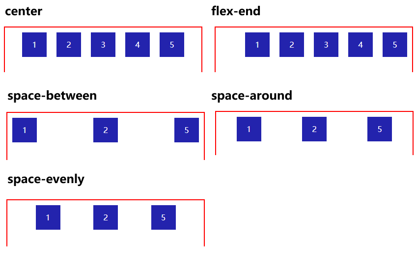

# 容器为flex类型
## display
- **值：**`flex` | `inline-flex`
- **描述：** `flex` 值将使元素变为块级，而 `inline-flex` 值则使元素变为行内。

# 排列方向，垂直，水平，反转
## flex-direction
 - **值：**`row` | `row-reverse` | `column` | `column-reverse`
 - **描述：** 指定 Flex 容器中的排列方向。默认值是 `row`，即水平方向，但可以通过该属性更改为垂直方向或反向排列。
## 示例

# 换行
## flex-wrap
- **值：**`nowrap` | `wrap` | `wrap-reverse`
- **描述：** 指定 Flex 项是否应该换行。默认值是 `nowrap`，表示不换行。`wrap` 值允许换行，`wrap-reverse` 则允许反向换行。
## 示例

# 水平对齐
## justify-content
- **值：** `flex-start` | `flex-end` | `center` | `space-between` | `space-around` | `space-evenly`
- **描述：** 指定 Flex 项在水平上的对齐方式。默认值是 `flex-start`，表示左对齐。其他值包括右对齐、居中对齐、两端对齐和等间距对齐。
## 示例

# 垂直对齐
## align-items
- **值：**`flex-start` | `flex-end` | `center` | `baseline` | `stretch`
- **描述：** 指定 Flex 项垂直对齐方式。默认值是 `stretch`，表示拉伸以填充容器。其他值包括顶部对齐、底部对齐、居中对齐和基线对齐。
## 示例

# 多行垂直对齐
> 仅在存在多行时生效,设置：`flex-wrap: wrap` 。`align-content`属性才生效
## align-content：
- **值：**`flex-start` | `flex-end` | `center` | `space-between` | `space-around` | `stretch`
- **描述：** 垂直对齐方式。**仅在存在多行时生效**。默认值是 `stretch`，表示拉伸以填充容器。其他值包括顶部对齐、底部对齐、居中对齐、两端对齐和拉伸对齐。
## 示例

# 收缩比例
## flex
`flex:1 2% 2`
> `flex`是`flex-grow`，`flex-shrink`，`flex-basis`缩写，参数给flex中的子元素设置
- **值：**`<flex-grow> <flex-shrink> <flex-basis>`
- **描述：** 指定 Flex 项的扩展比例、收缩比例和基准尺寸。`flex-grow` 控制 Flex 项在剩余空间中的扩展比例，默认值为 0。`flex-shrink` 控制 Flex 项在空间不足时的收缩比例，默认值为 1。`flex-basis` 指定 Flex 项在分配空间之前的基准尺寸，默认值为 `auto`。

- `flex-grow`属性定义项目的放大比例，默认为0，即如果存在剩余空间，也不放大。
- `flex-shrink`属性定义了项目的缩小比例，默认为1，即如果空间不足，该项目将缩小。
- `flex-basis`属性定义了在分配多余空间之前，项目占据的水平空间（main size）。浏览器根据这个属性，计算水平是否有多余空间。它的默认值为auto，即项目的本来大小。
  

## 示例

# 调整排序
## order
> 属性给`flex`中的**子元**素设置
- **值：** 整数
- **描述：** 指定 Flex 项的排列顺序。默认值为 0。数值越小，Flex 项越靠前。这些是 Flex 布局中常用的属性，它们一起提供了对 Flex 容器和 Flex 项的灵活控制，以实现各种布局需求。请根据实际情况选择合适的属性组合来达到你想要的布局效果。
## 示例

# 水平，换行简写

## flex-flow
- **值：**`<flex-direction> <flex-wrap>`
- **描述：** `flex-direction` 和 `flex-wrap` 的简写属性，可以一起指定 Flex 项的排列方向和是否换行。