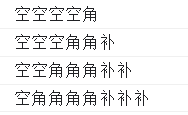
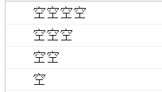
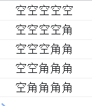
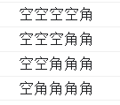
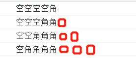

# 思路


1. 整体行数为`4`，为大循环所需要的循环。
2. 第一行循环`4`个**空**，`1`**角**
3. 第二行循环`3`个**空**，`2`**角**，`1`**补**
4. 第三行循环`2`个**空**，`3`**角**，`2`**补**
5. 第四行循环`1`个**空**，`4`**角**，`3`**补**

## 父循环
```javaScript
for(let i = 1; i < 5; i++){
    
}
```
## 循环—空

```javaScript
for (let i = 1; i < 5; i++) {
    let str = ''
    for (let j = i; j < 5; j++) {
        str += '空'
    }
    console.log(str)
}
```
## 循环-角
> 为什么`i`会从`1`开始，如果从`0`开始则会多出一行没有用的空



**正确：**


```javaScript
for (let i = 1; i < 5; i++) {
    let str = ''
    for (let j = i; j < 5; j++) {
        str += '空'
    }
    for(let g = 0; g<i;g++ ){
        str += '角'
    }
    console.log(str)
}
```
## 补齐后面的角实现等腰三角


- 条件：第一次不循环
- 第二次才开始循环
- `i`是递增的，所以可以把`i`的赋予第三个循环的变量进行减`1`，且当前变量大于`0`才执行，这样就可以让他只在第二次中进行循环,当前变量最终会随着`i`不断增加所以这里递增变为递减。
```javaScript
for (let i = 1; i < 5; i++) {
    let str = ''
    for (let j = i; j < 5; j++) {
        str += '空'
    }
    for(let g = 0; g<i;g++ ){
        str += '角'
    }
    for(let d = i - 1; d > 0; d--) {
        str += '角'
    }
    console.log(str)
}
```
# 思路二
```javascript
let str = ''
for (let i = 0; i < 5; i++) {
    for (let j = 0; j < 5 - i; j++) {
        str += '空'
    }
    for (let d = 0; d < 2 * i - 1; d++) {
        str += '角'
    }
    str += '\n'
}
console.log(str)
```