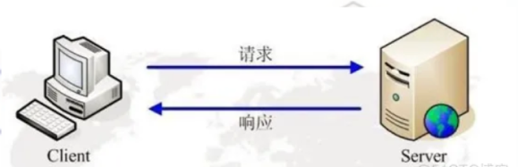

# 请求和模板渲染



- 通过后端给的请求地址获取服务器返回的数据

- `ajax`请求用法
- 请求封装

## $.post()

`POST`请求则用于向服务器提交数据，它会将参数放在请求的消息体中一起发送到服务器。因为`POST`请求不会将参数暴露在`URL`中，所以相对于`GET`请求更加安全，适合用于修改服务端状态或者提交敏感数据的场景。

- 参数1：`url`请求数据地址
- 参数2：请求参数
- 参数3：回调函数，接受请求返回数据结果
- 参数4：请求返回数据结果一般都是json

```javaScript
$.post(url, param, functon(res) {
    console.log(res,'返回结果')
}, 'json')
```

## $.get()

`GET`请求用于从服务器获取资源，它将参数以查询字符串（query string）的形式附加在URL后面发送。因为`GET`请求将参数暴露在`URL`中，所以安全性较低，适合用于获取数据或者浏览页面等无需修改服务端状态的场景。

- 参数1：`url`请求数据地址
- 参数2：请求参数
- 参数3：回调函数，接受请求返回数据结果
- 参数4：请求返回数据结果一般都是`json`

```javaScript
$.get(url, param,functon (res) {
    console.log(res,'返回结果')
}, 'json')
```
## 封装请求

为什么要封装请求？为了后续方便管理请求中的`api`和代码的复用性。

`jQuery`中的请求设置

```javascript
//全局ajax请求配置
$.ajaxSetup({
    //请求拦截器
    beforeSend: function (xhr, settings) {
        settings.url = baseURL + settings.url;
    },
    //响应完成后
    complete: function (xhr, status) {
        console.log(xhr, '完成后回调');
    },
    error: function (error) {
        console.error('请求发生错误：' + error);
    }
});
/**
 * @param {string} url   - 请求地址
 * @param {object} param - 请求参数
 */
const request = {
    post: function (url, param) {
        return new Promise((resolve, reject) => {
            $.post(url, param, (res) => {
                resolve(res)
            }, 'json')
        })
    },
    get: function (url, param) {
        return new Promise((resolve, reject) => {
            $.get(url, param, (res) => {
                resolve(res)
            }, 'json')
        })
    }
}
```
## 请求接口
```javascript
//轮播图请求
const swiperdata = function(param) {
    return request.get('home/swiperdata',param)
}
```

---

# 模板渲染

## 前后不分离的情况下什么时候使用请求？

- 页面加载时，所有数据都有后端模板进行渲染。
- 在后续操作的一些功能更新数据都由`ajax`请求获取
- 或者使用`js`请求地址跳转传递参数由模板进行更新数据,这种方式一般做筛选或者分类。

```html

```
